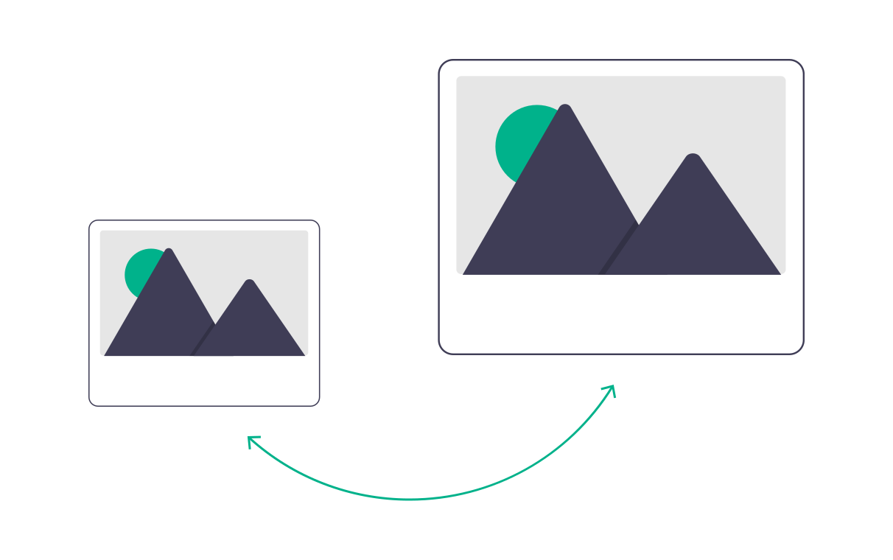

    
    <h3>compact</h3>
    
<i>An optimizing and compressing library for images</i>

`compact` is an image optimization and compression library. It can optimize and image by reducing its size for a set of different media – print, web, mobile – and it can compress image files for efficient storage. **This is an experimental and educational library and no real advantages are expected over other known techniques or libraries.**

**Optimization**

An experimental API to optimize images that are used in web pages, mobile apps, or printed media. The first implementation will only adjust the size of the image to be an appropriate size for the type of media selected. Later versions will include more sophisticated optimizations that result in smaller file sizes, and new features such as increasing image size by inferring missing pixels.

**Compression**

The compression API is used to package image files into compressed versions of themselves. The compression is experimental, and a real-world advantage is unlikely when using instead of existing compression techniques.
